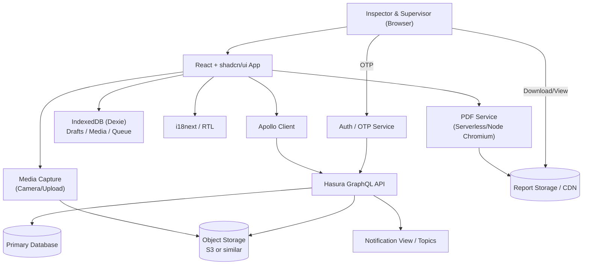
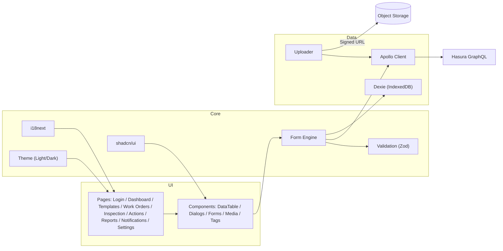
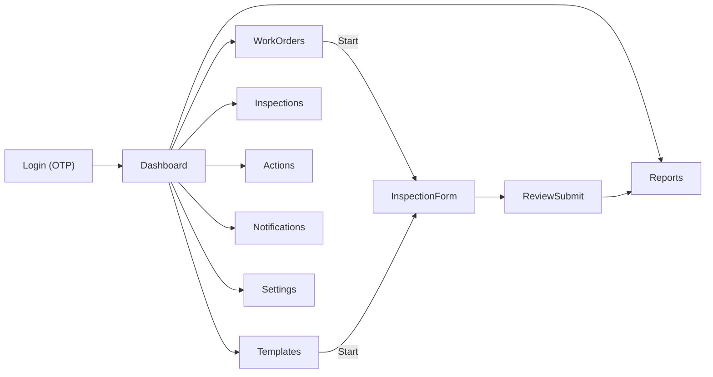
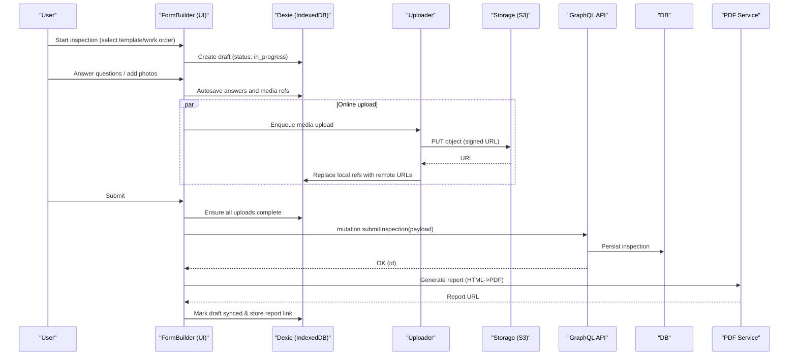
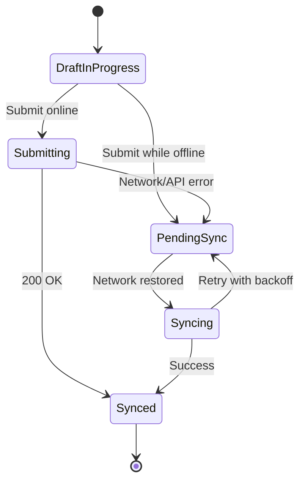
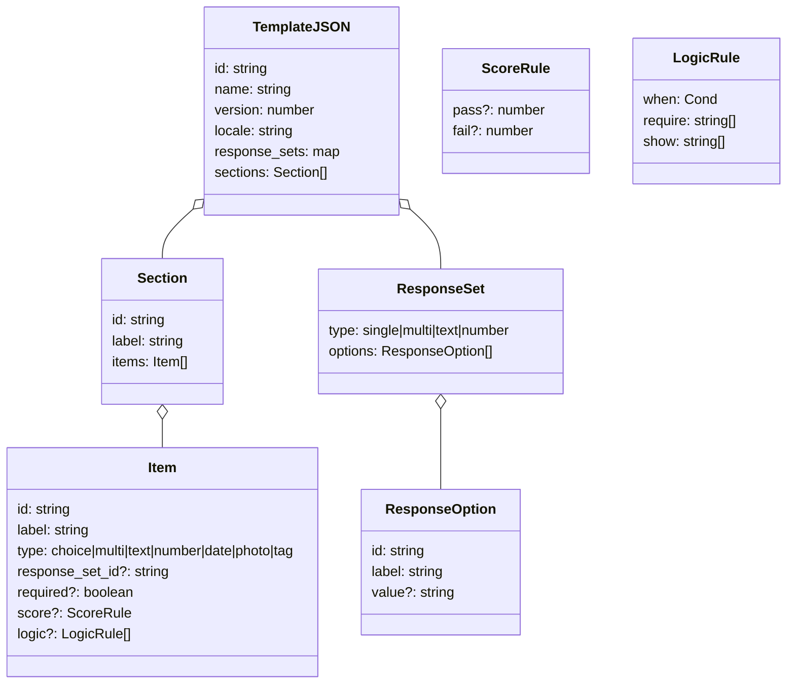
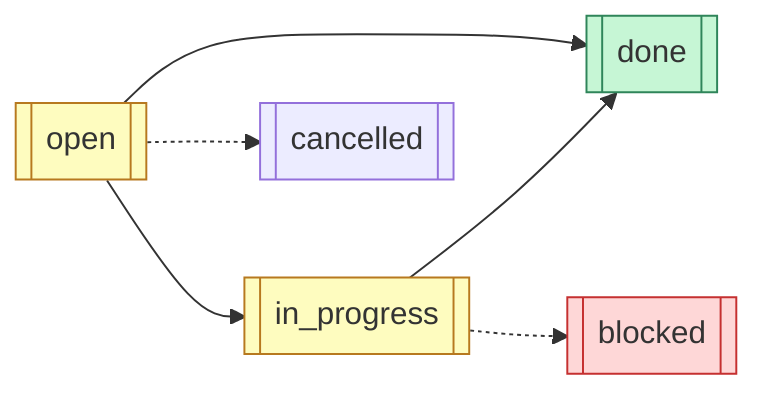
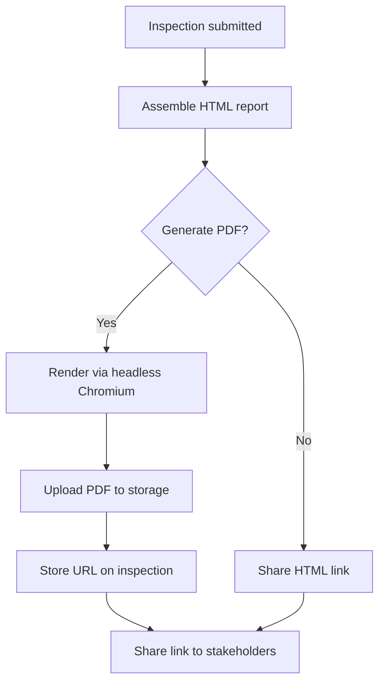
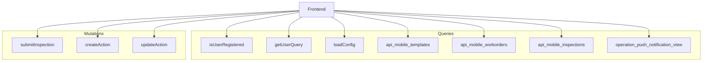
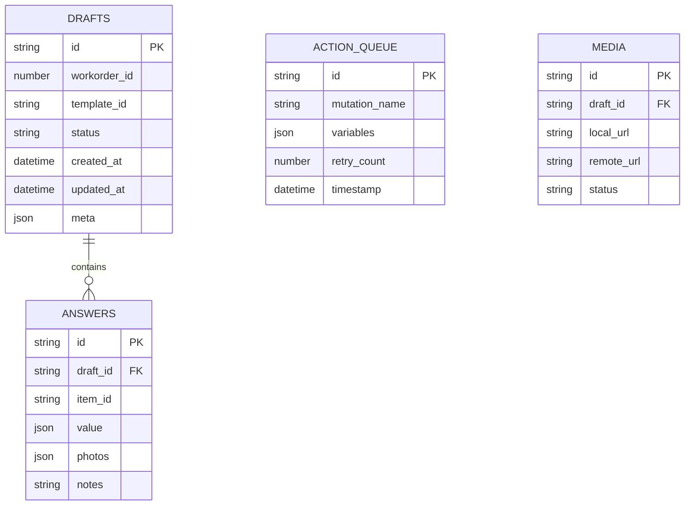

## Mermaid Diagrams: Inspections Web App

### 1) System Architecture (High-Level)

### 2) Frontend Module Architecture

### 3) App Navigation Flow

### 4) Inspection Lifecycle (Sequence)

### 5) Offline Sync State Machine

### 6) Template Model (Internal) and Mapping

### 7) Actions Workflow

### 8) Report Generation Flow

### 9) GraphQL Operations Map

### 10) Local Data Model (IndexedDB)

